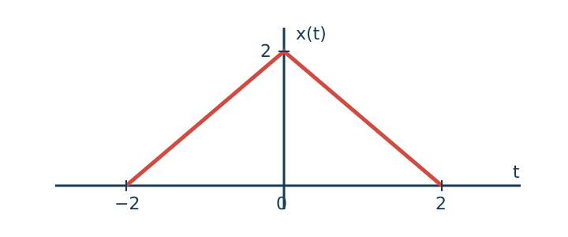
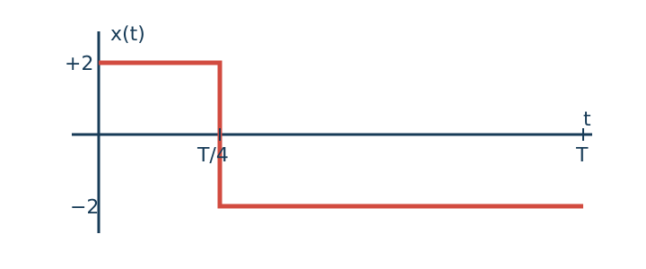
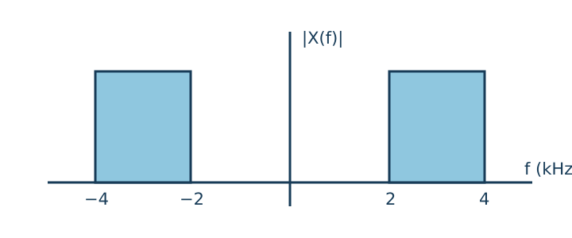

# GATE EE Corpus V1 — Source Batch 004 Signals and Systems

**Status:** DRAFT — NOT PAPER-ELIGIBLE
**Questions:** 15

This is a deterministic view of the canonical JSONL source. Review decisions belong in checksum-bound review artifacts, not in this generated document.

---

## TMB-GATE-EE-SS-001 — revision 1

**Route:** Electrical Engineering → Signals and Systems → Continuous and Discrete Signals
**Type / marks / difficulty:** MCQ / 1 / Easy
**Family:** `SS-SIG-PERIOD-001`

### Question

The continuous-time signal $x(t)=\cos(4t)+\sin(6t)$ is periodic. Determine its fundamental period.

### Options

- A. $\frac{\pi}{3}\,\mathrm{s}$
- B. $\frac{\pi}{2}\,\mathrm{s}$
- C. $\pi\,\mathrm{s}$
- D. $2\pi\,\mathrm{s}$

### Declared answer

C

### Canonical solution

The angular frequencies are $4$ and $6\,\mathrm{rad/s}$. Their greatest common divisor is $\omega_0=2\,\mathrm{rad/s}$, so the fundamental period is $T_0=\frac{2\pi}{\omega_0}=\pi\,\mathrm{s}$.
Final answer: C

### Review state

Technical, answer, solution, originality, duplicate-family and Formatter checks are pending unless superseded by a checksum-bound qualification artifact.

---

## TMB-GATE-EE-SS-002 — revision 1

**Route:** Electrical Engineering → Signals and Systems → Continuous and Discrete Signals
**Type / marks / difficulty:** NAT / 1 / Easy
**Family:** `SS-SIG-ENERGY-001`

### Question

For the discrete-time signal $x[n]=(\frac{1}{2})^n u[n]$, determine the signal energy $\sum_{n=-\infty}^{\infty}|x[n]|^2$.

### Declared answer

1.333

### Canonical solution

Because $u[n]$ restricts the sequence to $n\geq 0$, the energy is $E=\sum_{n=0}^{\infty}(\frac{1}{4})^n=\frac{1}{1-1/4}=\frac{4}{3}=1.333$ to three decimal places.
Final answer: 1.333

### Review state

Technical, answer, solution, originality, duplicate-family and Formatter checks are pending unless superseded by a checksum-bound qualification artifact.

---

## TMB-GATE-EE-SS-003 — revision 1

**Route:** Electrical Engineering → Signals and Systems → Continuous and Discrete Signals
**Type / marks / difficulty:** MSQ / 2 / Hard
**Family:** `SS-SIG-SYSPROP-001`

### Question

A continuous-time system is defined by $y(t)=t\,x(t)$. Select all properties that this system satisfies.

### Options

- A. Linear
- B. Time invariant
- C. Memoryless
- D. Causal

### Declared answer

A, C, D

### Canonical solution

Superposition is preserved because multiplication by the fixed function $t$ is linear. The output at $t$ depends only on $x(t)$, so the system is memoryless and causal. For a shifted input, the response is $t\,x(t-t_0)$, whereas a shifted version of the original output is $(t-t_0)x(t-t_0)$; hence the system is time varying.
Final answer: A, C, D

### Review state

Technical, answer, solution, originality, duplicate-family and Formatter checks are pending unless superseded by a checksum-bound qualification artifact.

---

## TMB-GATE-EE-SS-004 — revision 1

**Route:** Electrical Engineering → Signals and Systems → Continuous and Discrete Signals
**Type / marks / difficulty:** MCQ / 1 / Medium
**Family:** `SS-SIG-TRIENERGY-001`

### Question

The triangular signal shown in the figure is $x(t)=2-|t|$ for $|t|\leq 2$ and zero otherwise. Determine its energy.

### Options

- A. $\frac{8}{3}$
- B. $4$
- C. $\frac{16}{3}$
- D. $8$

### Figure

*Triangular signal $x(t)$*

### Declared answer

C

### Canonical solution

Using even symmetry, $E=2\int_0^2(2-t)^2\,dt=2[-(2-t)^3/3]_0^2=\frac{16}{3}$.
Final answer: C

### Review state

Technical, answer, solution, originality, duplicate-family and Formatter checks are pending unless superseded by a checksum-bound qualification artifact.

---

## TMB-GATE-EE-SS-005 — revision 1

**Route:** Electrical Engineering → Signals and Systems → LTI Systems and Convolution
**Type / marks / difficulty:** NAT / 2 / Medium
**Family:** `SS-LTI-CONVEXP-001`

### Question

Let $x(t)=e^{-t}u(t)$ and $h(t)=e^{-2t}u(t)$. If $y(t)=x(t)*h(t)$, determine $y(\ln 2)$.

### Declared answer

0.25

### Canonical solution

For $t\geq0$, $y(t)=\int_0^t e^{-\tau}e^{-2(t-\tau)}\,d\tau=e^{-2t}(e^t-1)=e^{-t}-e^{-2t}$. At $t=\ln2$, this is $\frac{1}{2}-\frac{1}{4}=0.25$.
Final answer: 0.25

### Review state

Technical, answer, solution, originality, duplicate-family and Formatter checks are pending unless superseded by a checksum-bound qualification artifact.

---

## TMB-GATE-EE-SS-006 — revision 1

**Route:** Electrical Engineering → Signals and Systems → LTI Systems and Convolution
**Type / marks / difficulty:** NAT / 1 / Easy
**Family:** `SS-LTI-EIGEN-001`

### Question

A real LTI system has frequency response $H(j2)=3e^{j\pi/6}$. For input $x(t)=\cos(2t+\pi/18)$, enter the amplitude of the steady-state output sinusoid.

### Declared answer

3

### Canonical solution

A sinusoid is an eigenfunction of an LTI system. Its amplitude is multiplied by $|H(j2)|=3$, while its phase is shifted by $\pi/6$. Therefore the output amplitude is $3$.
Final answer: 3

### Review state

Technical, answer, solution, originality, duplicate-family and Formatter checks are pending unless superseded by a checksum-bound qualification artifact.

---

## TMB-GATE-EE-SS-007 — revision 1

**Route:** Electrical Engineering → Signals and Systems → LTI Systems and Convolution
**Type / marks / difficulty:** MCQ / 2 / Medium
**Family:** `SS-LTI-DISCCONV-001`

### Question

For a discrete-time LTI system, $x[n]=h[n]=u[n]-u[n-3]$. Determine the output sample $y[2]$.

### Options

- A. $1$
- B. $2$
- C. $3$
- D. $4$

### Declared answer

C

### Canonical solution

Both $x[n]$ and $h[n]$ equal one at $n=0,1,2$. Hence $y[2]=\sum_k x[k]h[2-k]$ has contributions for $k=0,1,2$, each equal to one. Thus $y[2]=3$.
Final answer: C

### Review state

Technical, answer, solution, originality, duplicate-family and Formatter checks are pending unless superseded by a checksum-bound qualification artifact.

---

## TMB-GATE-EE-SS-008 — revision 1

**Route:** Electrical Engineering → Signals and Systems → Fourier Analysis
**Type / marks / difficulty:** MSQ / 1 / Medium
**Family:** `SS-FA-TWOLEVEL-001`

### Question

The periodic waveform shown in the figure equals $+2$ for $0\leq t<T/4$ and $-2$ for $T/4\leq t<T$. Select all correct statements.

### Options

- A. Its average value is $-1$.
- B. Its RMS value is $2$.
- C. Its average power is $4$.
- D. Its DC component is zero.

### Figure

*Two-level periodic waveform*

### Declared answer

A, B, C

### Canonical solution

The average is $2(1/4)-2(3/4)=-1$. Since $x^2(t)=4$ throughout the period, the RMS value is $\sqrt{4}=2$ and the average power is $4$. The nonzero average means the DC component is not zero.
Final answer: A, B, C

### Review state

Technical, answer, solution, originality, duplicate-family and Formatter checks are pending unless superseded by a checksum-bound qualification artifact.

---

## TMB-GATE-EE-SS-009 — revision 1

**Route:** Electrical Engineering → Signals and Systems → Fourier Analysis
**Type / marks / difficulty:** NAT / 2 / Hard
**Family:** `SS-FA-HARMPOWER-001`

### Question

The periodic input to a real LTI system is $x(t)=2+4\cos(\omega_0t)+3\sin(2\omega_0t)$. The frequency-response magnitudes are $|H(0)|=\frac{1}{2}$, $|H(j\omega_0)|=1$, and $|H(j2\omega_0)|=2$. Determine the average output power.

### Declared answer

27

### Canonical solution

The output DC value is $2(1/2)=1$. The two sinusoidal output amplitudes are $4$ and $6$. Orthogonality of distinct harmonics gives $P_y=1^2+\frac{4^2}{2}+\frac{6^2}{2}=1+8+18=27$.
Final answer: 27

### Review state

Technical, answer, solution, originality, duplicate-family and Formatter checks are pending unless superseded by a checksum-bound qualification artifact.

---

## TMB-GATE-EE-SS-010 — revision 1

**Route:** Electrical Engineering → Signals and Systems → Laplace Transform
**Type / marks / difficulty:** MCQ / 1 / Easy
**Family:** `SS-LT-ROC-001`

### Question

The signal $x(t)=e^{-2t}u(t)-e^{3t}u(-t)$ has a bilateral Laplace transform. Which region of convergence applies?

### Options

- A. $\operatorname{Re}(s)>3$
- B. $\operatorname{Re}(s)<-2$
- C. $-2<\operatorname{Re}(s)<3$
- D. $\operatorname{Re}(s)>-2$

### Declared answer

C

### Canonical solution

The right-sided term requires $\operatorname{Re}(s)>-2$. The left-sided term requires $\operatorname{Re}(s)<3$. Their intersection is $-2<\operatorname{Re}(s)<3$.
Final answer: C

### Review state

Technical, answer, solution, originality, duplicate-family and Formatter checks are pending unless superseded by a checksum-bound qualification artifact.

---

## TMB-GATE-EE-SS-011 — revision 1

**Route:** Electrical Engineering → Signals and Systems → Laplace Transform
**Type / marks / difficulty:** NAT / 2 / Medium
**Family:** `SS-LT-FINALVALUE-001`

### Question

A causal signal has Laplace transform $X(s)=\frac{s+4}{s(s+2)(s+3)}$. Determine its final value $\lim_{t\to\infty}x(t)$.

### Declared answer

0.667

### Canonical solution

All poles of $sX(s)$ lie in the open left half-plane, so the final-value theorem applies. Hence $x(\infty)=\lim_{s\to0}sX(s)=\frac{4}{(2)(3)}=\frac{2}{3}=0.667$ to three decimal places.
Final answer: 0.667

### Review state

Technical, answer, solution, originality, duplicate-family and Formatter checks are pending unless superseded by a checksum-bound qualification artifact.

---

## TMB-GATE-EE-SS-012 — revision 1

**Route:** Electrical Engineering → Signals and Systems → Z Transform
**Type / marks / difficulty:** MCQ / 1 / Medium
**Family:** `SS-ZT-INVERSE-001`

### Question

For $X(z)=\frac{z}{z-0.5}-\frac{z}{z-2}$ with region of convergence $|z|>2$, determine $x[n]$.

### Options

- A. $[(0.5)^n-2^n]u[n]$
- B. $[(0.5)^n-2^n]u[-n-1]$
- C. $(0.5)^nu[n]+2^nu[-n-1]$
- D. $-(0.5)^nu[-n-1]-2^nu[n]$

### Declared answer

A

### Canonical solution

The stated region lies outside both poles, so both components are right sided. Using $\frac{z}{z-a}\leftrightarrow a^nu[n]$ gives $x[n]=(0.5)^nu[n]-2^nu[n]$.
Final answer: A

### Review state

Technical, answer, solution, originality, duplicate-family and Formatter checks are pending unless superseded by a checksum-bound qualification artifact.

---

## TMB-GATE-EE-SS-013 — revision 1

**Route:** Electrical Engineering → Signals and Systems → Z Transform
**Type / marks / difficulty:** MSQ / 2 / Hard
**Family:** `SS-ZT-ROCSTAB-001`

### Question

Consider $H(z)=\frac{1-0.5z^{-1}}{(1-0.25z^{-1})(1-2z^{-1})}$. Select all correct statements about possible regions of convergence.

### Options

- A. For $|z|>2$, the system is causal but unstable.
- B. For $0.25<|z|<2$, the system is stable and two sided.
- C. For $|z|<0.25$, the system is anti-causal and unstable.
- D. The system is FIR for every possible region of convergence.

### Declared answer

A, B, C

### Canonical solution

An outer ROC gives a right-sided causal impulse response, but it excludes the unit circle and is unstable. The annular ROC produces a two-sided response and includes the unit circle, so it is stable. The inner ROC gives a left-sided anti-causal response and excludes the unit circle, so it is unstable. The two uncancelled poles make the response IIR.
Final answer: A, B, C

### Review state

Technical, answer, solution, originality, duplicate-family and Formatter checks are pending unless superseded by a checksum-bound qualification artifact.

---

## TMB-GATE-EE-SS-014 — revision 1

**Route:** Electrical Engineering → Signals and Systems → Sampling
**Type / marks / difficulty:** NAT / 1 / Medium
**Family:** `SS-SAMP-NYQUIST-001`

### Question

The magnitude spectrum shown in the figure is nonzero only over $2\leq |f|\leq4\,\mathrm{kHz}$. Using the conventional baseband sampling theorem, enter the minimum sampling frequency in $\mathrm{kHz}$ that guarantees no aliasing.

### Figure

*Magnitude spectrum $|X(f)|$*

### Declared answer

8

### Canonical solution

The highest frequency present is $4\,\mathrm{kHz}$. The conventional Nyquist criterion requires $f_s\geq2f_{\max}=8\,\mathrm{kHz}$.
Final answer: 8

### Review state

Technical, answer, solution, originality, duplicate-family and Formatter checks are pending unless superseded by a checksum-bound qualification artifact.

---

## TMB-GATE-EE-SS-015 — revision 1

**Route:** Electrical Engineering → Signals and Systems → Sampling
**Type / marks / difficulty:** MCQ / 2 / Hard
**Family:** `SS-SAMP-ALIAS-001`

### Question

The signal $x(t)=\cos(2\pi\,1000t)+\cos(2\pi\,2600t)$ is sampled at $4\,\mathrm{kHz}$. The samples are passed through an ideal reconstruction low-pass filter with passband $0\leq f\leq2\,\mathrm{kHz}$. Which two positive-frequency components appear in the reconstructed signal?

### Options

- A. $0.6\,\mathrm{kHz}$ and $1.0\,\mathrm{kHz}$
- B. $1.0\,\mathrm{kHz}$ and $1.4\,\mathrm{kHz}$
- C. $1.0\,\mathrm{kHz}$ and $2.0\,\mathrm{kHz}$
- D. $1.4\,\mathrm{kHz}$ and $2.6\,\mathrm{kHz}$

### Declared answer

B

### Canonical solution

The $1\,\mathrm{kHz}$ component lies below Nyquist and is unchanged. The $2.6\,\mathrm{kHz}$ component folds about $4\,\mathrm{kHz}$ to $|2.6-4|=1.4\,\mathrm{kHz}$. Both $1.0$ and $1.4\,\mathrm{kHz}$ pass through the reconstruction filter.
Final answer: B

### Review state

Technical, answer, solution, originality, duplicate-family and Formatter checks are pending unless superseded by a checksum-bound qualification artifact.

---
