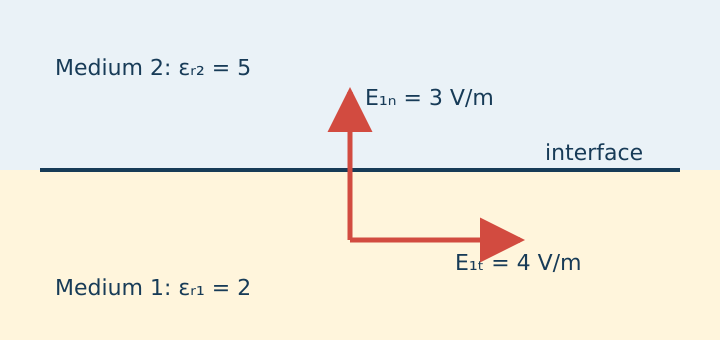
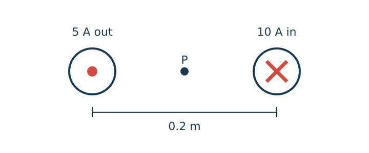
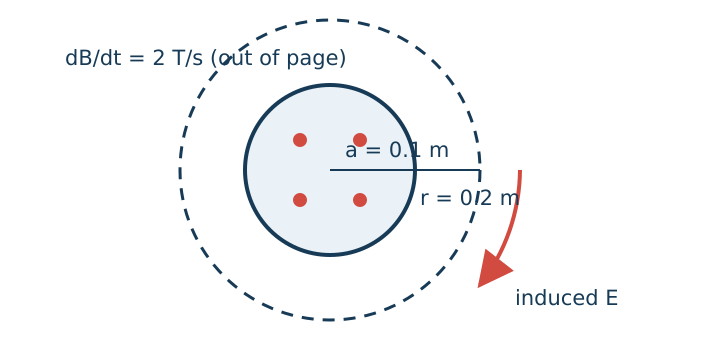

# GATE EE Corpus V1 — Source Batch 005 Electromagnetic Fields

**Status:** DRAFT — NOT PAPER-ELIGIBLE
**Questions:** 12

This is a deterministic view of the canonical JSONL source. Review decisions belong in checksum-bound review artifacts, not in this generated document.

---

## TMB-GATE-EE-EMFT-001 — revision 1

**Route:** Electrical Engineering → Electromagnetic Fields → Electrostatics
**Type / marks / difficulty:** MCQ / 1 / Easy
**Family:** `EMFT-ES-GAUSSFLUX-001`

### Question

A point charge $Q$ is located at the centre of a closed spherical surface. Which value equals $\oint_S\mathbf{D}\cdot d\mathbf{S}$?

### Options

- A. $0$
- B. $Q/(4\pi)$
- C. $Q$
- D. $Q/\varepsilon_0$

### Declared answer

C

### Canonical solution

Gauss law for electric flux density states $\oint_S\mathbf{D}\cdot d\mathbf{S}=Q_{\mathrm{enclosed}}$. The sphere encloses the complete point charge, so the integral equals $Q$.
Final answer: C

### Review state

Technical, answer, solution, originality, duplicate-family and Formatter checks are pending unless superseded by a checksum-bound qualification artifact.

---

## TMB-GATE-EE-EMFT-002 — revision 1

**Route:** Electrical Engineering → Electromagnetic Fields → Electrostatics
**Type / marks / difficulty:** NAT / 1 / Easy
**Family:** `EMFT-ES-LINECHARGE-001`

### Question

An infinite line charge in free space has uniform density $55.6\,\mathrm{nC/m}$. Determine the electric-field magnitude at radial distance $0.1\,\mathrm{m}$; enter the value in $\mathrm{kV/m}$. Use $\varepsilon_0=8.854\times10^{-12}\,\mathrm{F/m}$.

### Declared answer

9.994

### Canonical solution

For an infinite line charge, $E=\frac{\lambda}{2\pi\varepsilon_0\rho}$. Substitution gives $E=\frac{55.6\times10^{-9}}{2\pi(8.854\times10^{-12})(0.1)}=9.994\times10^3\,\mathrm{V/m}=9.994\,\mathrm{kV/m}$.
Final answer: 9.994

### Review state

Technical, answer, solution, originality, duplicate-family and Formatter checks are pending unless superseded by a checksum-bound qualification artifact.

---

## TMB-GATE-EE-EMFT-003 — revision 1

**Route:** Electrical Engineering → Electromagnetic Fields → Electrostatics
**Type / marks / difficulty:** MSQ / 2 / Hard
**Family:** `EMFT-ES-DIELBOUND-001`

### Question

The figure shows a charge-free boundary between dielectric 1 with $\varepsilon_{r1}=2$ and dielectric 2 with $\varepsilon_{r2}=5$. In medium 1, the electric field has normal component $3\,\mathrm{V/m}$ and tangential component $4\,\mathrm{V/m}$. Select all correct statements for medium 2.

### Options

- A. $D_{2n}=D_{1n}$
- B. $E_{2t}=E_{1t}$
- C. $E_{2n}=1.2\,\mathrm{V/m}$
- D. $|\mathbf{E}_2|=5\,\mathrm{V/m}$

### Figure

*Charge-free dielectric interface*

### Declared answer

A, B, C

### Canonical solution

With no free surface charge, the normal component of $\mathbf{D}$ is continuous, so $\varepsilon_1E_{1n}=\varepsilon_2E_{2n}$ and $E_{2n}=(2/5)(3)=1.2\,\mathrm{V/m}$. The tangential component of $\mathbf{E}$ is continuous, so $E_{2t}=4\,\mathrm{V/m}$. Therefore $|\mathbf{E}_2|=\sqrt{1.2^2+4^2}\neq5\,\mathrm{V/m}$.
Final answer: A, B, C

### Review state

Technical, answer, solution, originality, duplicate-family and Formatter checks are pending unless superseded by a checksum-bound qualification artifact.

---

## TMB-GATE-EE-EMFT-004 — revision 1

**Route:** Electrical Engineering → Electromagnetic Fields → Electrostatics
**Type / marks / difficulty:** MCQ / 1 / Medium
**Family:** `EMFT-ES-SPHCAP-001`

### Question

Two concentric conducting spheres of radii $a$ and $b$, with $b>a$, are separated by a dielectric of permittivity $\varepsilon$. Neglect fringing. Which expression gives the capacitance?

### Options

- A. $4\pi\varepsilon(a+b)$
- B. $4\pi\varepsilon\frac{ab}{b-a}$
- C. $4\pi\varepsilon\frac{b-a}{ab}$
- D. $\frac{\varepsilon ab}{4\pi(b-a)}$

### Declared answer

B

### Canonical solution

For charge $Q$, the potential difference is $V=\frac{Q}{4\pi\varepsilon}(\frac{1}{a}-\frac{1}{b})=\frac{Q(b-a)}{4\pi\varepsilon ab}$. Thus $C=Q/V=4\pi\varepsilon\frac{ab}{b-a}$.
Final answer: B

### Review state

Technical, answer, solution, originality, duplicate-family and Formatter checks are pending unless superseded by a checksum-bound qualification artifact.

---

## TMB-GATE-EE-EMFT-005 — revision 1

**Route:** Electrical Engineering → Electromagnetic Fields → Electrostatics
**Type / marks / difficulty:** NAT / 2 / Medium
**Family:** `EMFT-ES-SPHEREPOT-001`

### Question

A solid sphere of radius $0.1\,\mathrm{m}$ carries a uniform volume charge with total charge $8\,\mathrm{nC}$ in free space. Determine the potential at the centre relative to the potential at the surface, in volts. Use $\varepsilon_0=8.854\times10^{-12}\,\mathrm{F/m}$.

### Declared answer

359.5

### Canonical solution

Inside a uniformly charged sphere, the centre-to-surface potential difference is $V(0)-V(a)=\frac{Q}{8\pi\varepsilon_0a}$. Hence the requested value is $\frac{8\times10^{-9}}{8\pi(8.854\times10^{-12})(0.1)}=359.5\,\mathrm{V}$.
Final answer: 359.5

### Review state

Technical, answer, solution, originality, duplicate-family and Formatter checks are pending unless superseded by a checksum-bound qualification artifact.

---

## TMB-GATE-EE-EMFT-006 — revision 1

**Route:** Electrical Engineering → Electromagnetic Fields → Electrostatics
**Type / marks / difficulty:** NAT / 1 / Easy
**Family:** `EMFT-ES-PARTDIEL-001`

### Question

A parallel-plate capacitor has half of its plate area filled through the full separation with a dielectric of relative permittivity $3$; the other half remains air. Neglect fringing. Enter the ratio of its capacitance to the all-air capacitance.

### Declared answer

2

### Canonical solution

The two half-area regions are in parallel. Thus $C=\frac{\varepsilon_0(A/2)}{d}+\frac{3\varepsilon_0(A/2)}{d}=2\frac{\varepsilon_0A}{d}$. Relative to the all-air value $\varepsilon_0A/d$, the ratio is $2$.
Final answer: 2

### Review state

Technical, answer, solution, originality, duplicate-family and Formatter checks are pending unless superseded by a checksum-bound qualification artifact.

---

## TMB-GATE-EE-EMFT-007 — revision 1

**Route:** Electrical Engineering → Electromagnetic Fields → Magnetostatics
**Type / marks / difficulty:** MCQ / 2 / Medium
**Family:** `EMFT-MS-TWOWIRE-001`

### Question

The figure shows two infinitely long parallel conductors separated by $0.2\,\mathrm{m}$. The left conductor carries $5\,\mathrm{A}$ out of the page and the right conductor carries $10\,\mathrm{A}$ into the page. Determine the magnetic-flux-density magnitude at the midpoint.

### Options

- A. $10\,\mu\mathrm{T}$
- B. $15\,\mu\mathrm{T}$
- C. $30\,\mu\mathrm{T}$
- D. $45\,\mu\mathrm{T}$

### Figure

*Parallel conductors and midpoint $P$*

### Declared answer

C

### Canonical solution

The midpoint is $0.1\,\mathrm{m}$ from each conductor. By the right-hand rule the two fields point in the same direction there. Hence $B=\frac{\mu_0(5+10)}{2\pi(0.1)}=30\times10^{-6}\,\mathrm{T}=30\,\mu\mathrm{T}$.
Final answer: C

### Review state

Technical, answer, solution, originality, duplicate-family and Formatter checks are pending unless superseded by a checksum-bound qualification artifact.

---

## TMB-GATE-EE-EMFT-008 — revision 1

**Route:** Electrical Engineering → Electromagnetic Fields → Magnetostatics
**Type / marks / difficulty:** MSQ / 1 / Medium
**Family:** `EMFT-MS-BOUNDARY-001`

### Question

Select all statements that are valid in magnetostatics for ordinary media without magnetic monopoles.

### Options

- A. $\oint_C\mathbf{H}\cdot d\mathbf{l}$ equals the free current enclosed by $C$.
- B. $\nabla\cdot\mathbf{B}=0$.
- C. A free surface-current density can produce a discontinuity in tangential $\mathbf{H}$.
- D. The normal component of $\mathbf{B}$ may have an arbitrary discontinuity even when no magnetic monopoles exist.

### Declared answer

A, B, C

### Canonical solution

Ampere law gives $\oint_C\mathbf{H}\cdot d\mathbf{l}=I_{\mathrm{free,enclosed}}$. Gauss law for magnetism gives $\nabla\cdot\mathbf{B}=0$, which also enforces continuity of normal $\mathbf{B}$. A free surface current produces the standard tangential-$\mathbf{H}$ jump. Therefore the first three statements are correct and the fourth is false.
Final answer: A, B, C

### Review state

Technical, answer, solution, originality, duplicate-family and Formatter checks are pending unless superseded by a checksum-bound qualification artifact.

---

## TMB-GATE-EE-EMFT-009 — revision 1

**Route:** Electrical Engineering → Electromagnetic Fields → Magnetic Circuits
**Type / marks / difficulty:** NAT / 2 / Hard
**Family:** `EMFT-MC-GAPTOROID-001`

### Question

A toroidal magnetic core has mean magnetic path length $0.5\,\mathrm{m}$, relative permeability $1000$, and a single air gap of length $1\,\mathrm{mm}$. A $500$-turn winding carries $0.2\,\mathrm{A}$. Neglect leakage and fringing. Determine the flux density in tesla.

### Declared answer

0.0838

### Canonical solution

The same flux density crosses the core and gap. The magnetic-circuit relation is $NI=\frac{B}{\mu_0\mu_r}l_c+\frac{B}{\mu_0}l_g$. Thus $B=\frac{\mu_0NI}{l_g+l_c/\mu_r}=\frac{(4\pi\times10^{-7})(500)(0.2)}{0.001+0.5/1000}=0.0838\,\mathrm{T}$.
Final answer: 0.0838

### Review state

Technical, answer, solution, originality, duplicate-family and Formatter checks are pending unless superseded by a checksum-bound qualification artifact.

---

## TMB-GATE-EE-EMFT-010 — revision 1

**Route:** Electrical Engineering → Electromagnetic Fields → Electromagnetic Induction
**Type / marks / difficulty:** MCQ / 1 / Medium
**Family:** `EMFT-EI-FARADAY-001`

### Question

A single-turn loop links magnetic flux $\Phi(t)=(4t^2+2t)\,\mathrm{mWb}$. Determine the magnitude of the induced emf at $t=0.5\,\mathrm{s}$.

### Options

- A. $2\,\mathrm{mV}$
- B. $4\,\mathrm{mV}$
- C. $6\,\mathrm{mV}$
- D. $8\,\mathrm{mV}$

### Declared answer

C

### Canonical solution

Faraday law gives $|e|=|d\Phi/dt|$. Here $d\Phi/dt=(8t+2)\,\mathrm{mWb/s}$, so at $t=0.5\,\mathrm{s}$ the magnitude is $6\,\mathrm{mV}$.
Final answer: C

### Review state

Technical, answer, solution, originality, duplicate-family and Formatter checks are pending unless superseded by a checksum-bound qualification artifact.

---

## TMB-GATE-EE-EMFT-011 — revision 1

**Route:** Electrical Engineering → Electromagnetic Fields → Electromagnetic Induction
**Type / marks / difficulty:** NAT / 2 / Medium
**Family:** `EMFT-EI-MOTIONAL-001`

### Question

A conducting rod of length $0.5\,\mathrm{m}$ moves at $4\,\mathrm{m/s}$ perpendicular to a uniform magnetic field of $0.8\,\mathrm{T}$. The rod completes a circuit of total resistance $2\,\Omega$. Neglect friction. Enter the external force required to maintain constant speed, in millinewtons.

### Declared answer

320

### Canonical solution

The motional emf is $e=Blv=(0.8)(0.5)(4)=1.6\,\mathrm{V}$, so $I=e/R=0.8\,\mathrm{A}$. The opposing magnetic force is $F=BIl=(0.8)(0.8)(0.5)=0.32\,\mathrm{N}=320\,\mathrm{mN}$.
Final answer: 320

### Review state

Technical, answer, solution, originality, duplicate-family and Formatter checks are pending unless superseded by a checksum-bound qualification artifact.

---

## TMB-GATE-EE-EMFT-012 — revision 1

**Route:** Electrical Engineering → Electromagnetic Fields → Electromagnetic Induction
**Type / marks / difficulty:** MCQ / 2 / Hard
**Family:** `EMFT-EI-SOLENOID-E-001`

### Question

The cross-sectional figure shows a long solenoid of radius $0.1\,\mathrm{m}$ whose uniform internal magnetic flux density changes at $dB/dt=2\,\mathrm{T/s}$. Neglect the field outside the solenoid. Determine the induced electric-field magnitude on a circular path of radius $0.2\,\mathrm{m}$ concentric with the solenoid.

### Options

- A. $0.0125\,\mathrm{V/m}$
- B. $0.025\,\mathrm{V/m}$
- C. $0.05\,\mathrm{V/m}$
- D. $0.10\,\mathrm{V/m}$

### Figure

*Solenoid cross-section and circular observation path*

### Declared answer

C

### Canonical solution

For $r>a$, Faraday law gives $2\pi rE=\pi a^2|dB/dt|$. Therefore $E=\frac{a^2}{2r}|dB/dt|=\frac{0.1^2}{2(0.2)}(2)=0.05\,\mathrm{V/m}$.
Final answer: C

### Review state

Technical, answer, solution, originality, duplicate-family and Formatter checks are pending unless superseded by a checksum-bound qualification artifact.

---
